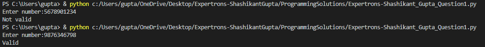
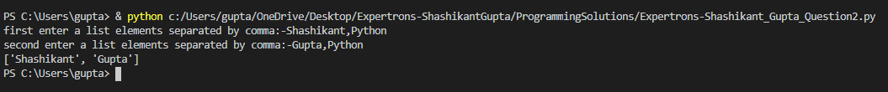
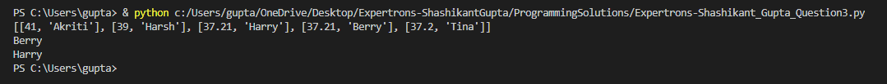

# Expertrons_Solution
## Question1
1. Every number should contains exactly 10 digits
2. The first digit should be 7 or 8 or 9
[7-9][0-9][0-9][0-9][0-9][0-9][0-9][0-9][0-9][0-9]
 or
[7-9][0-9]{9}
 or
[7-9]\d{9}

## Question2

## Question3

